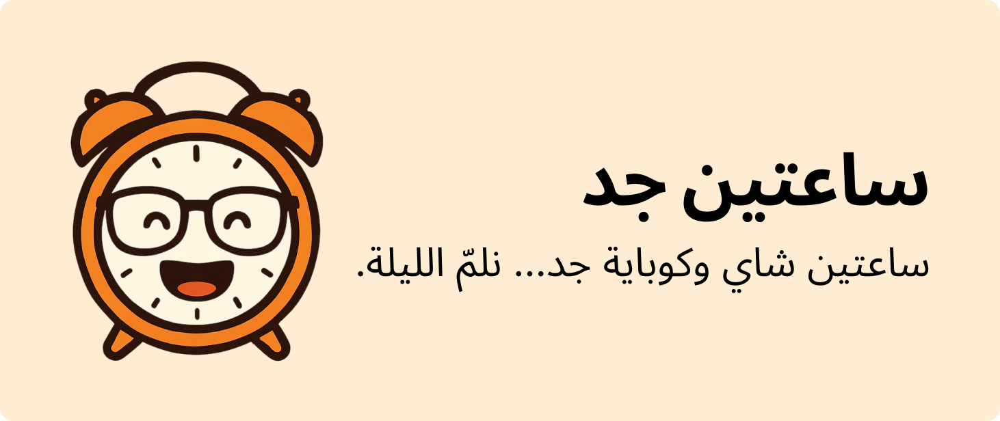

 <!-- Replace with actual path once banner is added -->

# Sa3teen Gad (Under Development) 🚧

**Sa3teen Gad** is your personal productivity buddy. It helps you stay focused and balanced throughout your workday—with a playful and minimal UI. Whether you're working, in a meeting, or just need a reminder to drink water or pray, Sa3teen Gad has your back.

> ⚠️ **Note**: This app is currently under active development. Expect rapid changes and frequent updates!

---

## ✨ Features

- ✅ **To-Do List**  
  Keep track of your daily tasks with a clean and simple to-do interface.

- 🍅 **Pomodoro Timer**  
  Classic focus timer to keep you productive in bursts—with short and long breaks.

- 💧 **Water Reminder**  
  Gentle nudges to stay hydrated while working.

- 🕌 **Prayer Reminder**  
  Get notified when it's time to pray, so you never miss a prayer.

- 📅 **Meetings Mode**  
  Pause all timers and tasks with a single click when a meeting starts.

- ⏱ **Time Worked Tracker**  
  Automatically track how long you've worked today.

- 📊 **Analytics Tab**  
  Visual breakdown of your productivity stats over time.

---

## 🛠 How It Works

- Start your Pomodoro or select a task to begin.
- When a **meeting** starts, just hit the _"Meeting Started"_ button—this will **pause** any running timers or ongoing tasks.
- View your **analytics tab** to reflect on your work patterns and find areas to improve.

---

## 🚀 Getting Started

```bash
# Clone the repo
git clone https://github.com/AbdelrahmanMostafa0/sa3teen-gad

# Navigate to the folder
cd sa3teen-gad

# Install dependencies
npm install

# Start the development server
npm run dev
